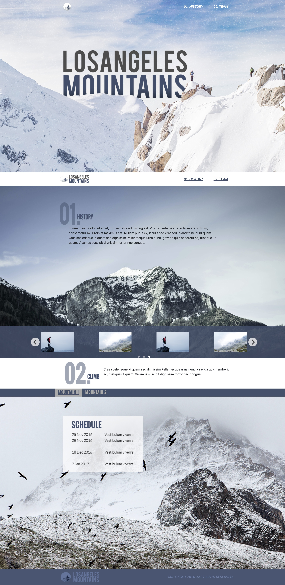

# Coalition Technologies Front-End Skill Test V3

## [LIVE DEMO](https://jzilla808.github.io/Coalition-Technologies-Skill-Test-Challenge/)

## Project Overview

I am excited to present my skills test submission for the front-end position at Coalition Technologies. This project showcases my proficiency in converting Adobe Photoshop designs into fully functional, responsive single-page web applications.

## Key Features

- Transformed the provided PSD into a dynamic, single-page website
- Responsive design that adjusts flawlessly across different devices
- Responsive carousel that adapts seamlessly to various screen sizes using pure CSS
- Mobile-friendly design where tabs convert into an accordion layout, enhancing usability on smaller screens

## Technologies Used

- HTML5
- CSS3
- JavaScript
- jQuery
- Flickity
- Bootstrap
- Adobe Photoshop

## Demonstration of Skills

This project demonstrates my commitment to delivering high-quality, user-centric web solutions. It highlights my ability to:

- Accurately translate design mockups into pixel-perfect, responsive web pages
- Implement interactive features such as carousels and accordions
- Optimize websites for seamless performance across various devices and screen sizes
- Write clean, maintainable, and efficient code
- Implemented a visually appealing and intuitive hover animation for navigation links using pure CSS, demonstrating strong command of front-end techniques and attention to detail

## Getting Started

To view the project, simply open the `index.html` file in your preferred web browser. The website is fully responsive and can be tested by resizing the browser window or using the developer tools to simulate different devices.

## Feedback and Contact

I appreciate the opportunity to showcase my skills and would welcome any feedback or questions you may have. Please feel free to reach out to me to discuss my submission further.

